<!--
  ehsndvr / ehsndvr — profile README

  · Header and divider are hand-made SVGs in assets/ (dark + light variants, chosen via <picture>).
  · The activity card and the contribution snake are generated by .github/workflows/profile.yml
    and published to the `output` branch, referenced through raw.githubusercontent.com.
    The workflow runs on every push to main and daily; it can also be run manually from the Actions tab.
-->

<picture>
  <source media="(prefers-color-scheme: dark)" srcset="assets/header-dark.svg">
  <source media="(prefers-color-scheme: light)" srcset="assets/header-light.svg">
  
</picture>

 

I build bots, backend services and the small tools that keep servers running. Most of my work is in **Python**, **JavaScript** and **PHP** — lately that means async Python and [**baleio**](https://github.com/ehsndvr/baleio), an aiogram-style framework for [Bale](https://bale.ai) bots, plus a growing set of pragmatic DevOps scripts. On the side I'm learning **Rust** and modern **C++**.

<table>
  <tr>
    <td width="150"><b>Now</b></td>
    <td>Growing <a href="https://github.com/ehsndvr/baleio">baleio</a> and shipping server tooling from <a href="https://github.com/ehsndvr/tools">tools</a></td>
  </tr>
  <tr>
    <td><b>Learning</b></td>
    <td>Rust · modern C++</td>
  </tr>
  <tr>
    <td><b>Ask me about</b></td>
    <td>Async Python, bot frameworks, Laravel, Nginx + Let's Encrypt automation</td>
  </tr>
</table>

## Featured work

<table>
  <tr>
    <td width="50%" valign="top">
      <h3><a href="https://github.com/ehsndvr/baleio">baleio</a></h3>
      
A fully-async framework for Bale bots, inspired by aiogram — routers, magic filters, FSM, middlewares, Pydantic v2 models, long polling and webhooks.

      
<code>Python</code> <code>aiohttp</code> <code>Pydantic v2</code> <code>MIT</code> &nbsp;·&nbsp; <a href="https://pypi.org/project/baleio/">PyPI</a> · <a href="https://ehsndvr.github.io/baleio/">Docs</a>

    </td>
    <td width="50%" valign="top">
      <h3><a href="https://github.com/ehsndvr/tools">tools</a></h3>
      
Curated DevOps and server automation scripts. Includes <b>ezssl</b>: one command to put any local port behind Nginx with a Let's Encrypt certificate and HTTPS redirect.

      
<code>Shell</code> <code>Nginx</code> <code>Certbot</code>

    </td>
  </tr>
  <tr>
    <td width="50%" valign="top">
      <h3><a href="https://github.com/ehsndvr/ProProfile">ProProfile</a></h3>
      
A BetterDiscord plugin that copies a user's banner, avatar, bio and About Me to your own profile in one click.

      
<code>JavaScript</code> <code>BetterDiscord</code>

    </td>
    <td width="50%" valign="top">
      <h3><a href="https://github.com/ehsndvr/websocket-chat">websocket-chat</a></h3>
      
Real-time chat on Laravel broadcasting, backed by a self-hosted soketi (Pusher-compatible) WebSocket server.

      
<code>PHP</code> <code>Laravel</code> <code>soketi</code>

    </td>
  </tr>
</table>

## Stack

<table>
  <tr>
    <td width="150"><b>Languages</b></td>
    <td>
      <picture>
        <source media="(prefers-color-scheme: dark)" srcset="https://skillicons.dev/icons?i=python%2Cjs%2Cphp%2Ccs%2Cbash&theme=dark">
        
      </picture>
    </td>
  </tr>
  <tr>
    <td><b>Frameworks</b></td>
    <td>
      <picture>
        <source media="(prefers-color-scheme: dark)" srcset="https://skillicons.dev/icons?i=fastapi%2Claravel%2Cnodejs%2Cdotnet&theme=dark">
        
      </picture>
    </td>
  </tr>
  <tr>
    <td><b>Infra &amp; tooling</b></td>
    <td>
      <picture>
        <source media="(prefers-color-scheme: dark)" srcset="https://skillicons.dev/icons?i=linux%2Cnginx%2Cgit%2Cgithubactions&theme=dark">
        
      </picture>
    </td>
  </tr>
  <tr>
    <td><b>Learning</b></td>
    <td>
      <picture>
        <source media="(prefers-color-scheme: dark)" srcset="https://skillicons.dev/icons?i=rust%2Ccpp&theme=dark">
        
      </picture>
    </td>
  </tr>
</table>

## Activity

<picture>
  <source media="(prefers-color-scheme: dark)" srcset="https://raw.githubusercontent.com/ehsndvr/ehsndvr/output/stats-dark.svg">
  <source media="(prefers-color-scheme: light)" srcset="https://raw.githubusercontent.com/ehsndvr/ehsndvr/output/stats-light.svg">
  
</picture>

<picture>
  <source media="(prefers-color-scheme: dark)" srcset="https://raw.githubusercontent.com/ehsndvr/ehsndvr/output/snake-dark.svg">
  <source media="(prefers-color-scheme: light)" srcset="https://raw.githubusercontent.com/ehsndvr/ehsndvr/output/snake-light.svg">
  
</picture>

## Connect

  
  
  

  Header and cards are hand-made SVGs living in this repo. The activity card and snake are rebuilt daily by a GitHub Action — no third-party stat services.

